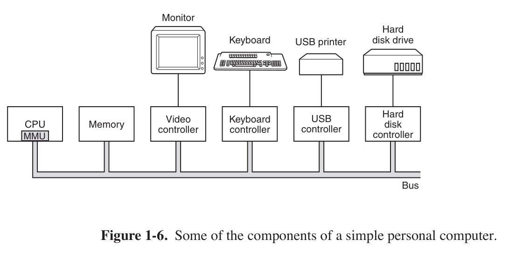
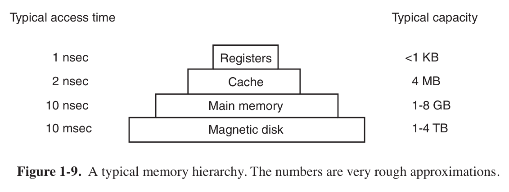
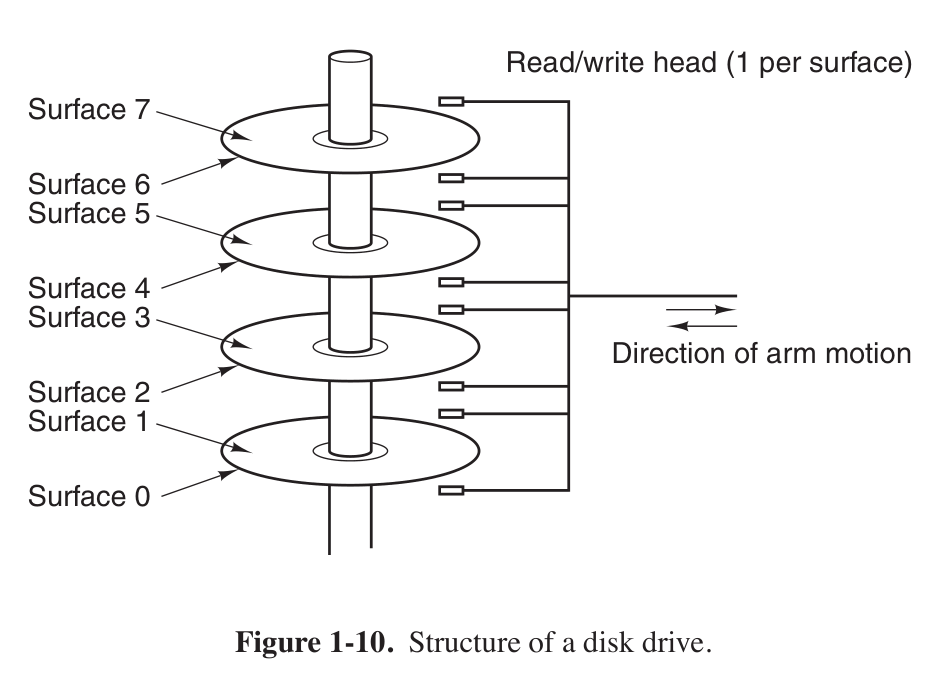

# 现代操作系统

## Chapter1 导论

- CPU
  - 寄存器
    - 通用寄存器: 存放变量和临时结果
    - 专业寄存器
      - 程序计数器, program counter: 保存了将要取出的下一条指令的内存地址
      - 堆栈指针, stack pointer:
      - 程序状态字 Program Status Word

计算机硬件组成:

1. 处理器CPU/GPU
2. 存储器
  1. 寄存器
  2. 高速缓存
  3. 主存(内存)
  4. 磁盘

存储层次图:

磁盘结构:
