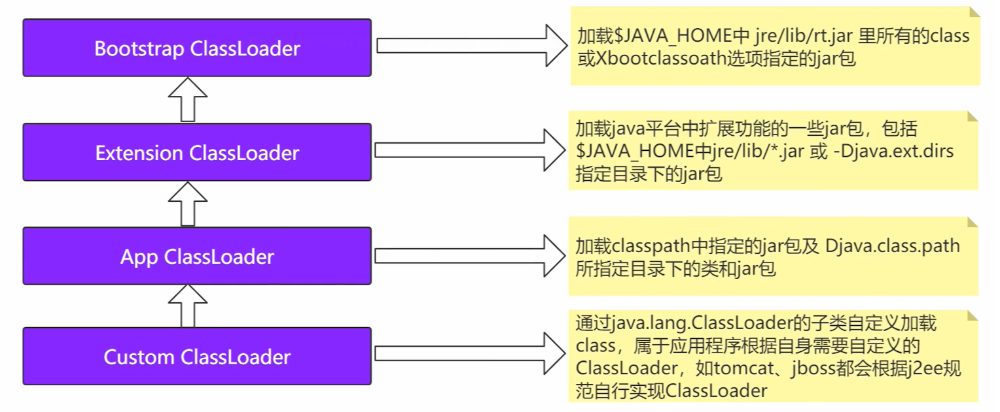
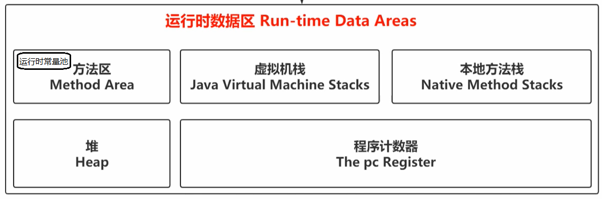

# 前言

环境: jvm基于jdk8
课程: 第三期
讲师: Jack

## JVM前奏篇(上)

### 类(.class)加载机制

#### 概要

理解为: .class文件到JVM的这个过程.

- 当类文件不是一个array class时: 
  - 通过使用ClassLoader
    - 有2类ClassLoader
      - bootstrap class loader (JVM提供的ClassLoader)
      - user-defined class loders (自定义ClassLoader), 必须是抽象类ClassLoader的子类
  - 加载二进制引用(binary representation) 相当于分配内存地址值
  - 加载一个二进制引用(binary representation)
  - 完成类文件的创建(Creation)
- 当类文件是一个array class时, 将会直接被JVM创建(Creation)


Loading, Linking And Initializing

- Loading
  - 找到类文件所在位置
  - 将类文件的信息交给JVM
  - 将类文件所对应的对象Class加载到JVM
- Linking
  - 验证verification: 确保二进制引用在结构正确
  - 准备preparation: 为类创建static fields 
    - 不做**显式**初始化操作(因为这是Initializing的部分)
    - 只根据field type, 做**默认值**的初始化操作
    - 比如int i = 10; 在该步, i只会初始化为int默认值**0**
  - 解析resolution: 将部分JVM指令的符号引用, 解析为运行时常量池(Run-Time Constant Pool)的直接引用
- Initializing: 完成class或interface里的显式初始化方法(initialization method)
  - 比如int i = 10; 在该步, i将会由**int默认值0变更为显式值10**

#### Loading

装载, 通过一个特殊的名称(全限定路径), 找到class或interface的二进制表示, 并通过二进制表示创建一个class或interface的过程

```markdown
Loading, is the process of finding the binary representation of a class or interface type with
a particular name and _creating_ a class or interface from that binary representation.
```

##### 找到.class文件的位置

```text
// name为.class文件的全路径名; 找到.class文件的位置
ClassLoader.find(name)
```

如下图, ClassLoader按功能模块划分, 使用双亲委派机制, 完成了.class文件装载到JVM中:

1. son装载时, 优先让parent装载
2. 当parent完成某个name的装载时, son将不会在对同样的name进行装载.



#####  类文件信息到JVM

### JVM Run-Time Data Area

数据划分如下图:



- Method Area方法区

  - 类文件信息
  - 运行时常量池Run-Time Constant Pool
  - 类文件中的static field
  - Class Pointer指针, 指向Heap中的具体Class Loader Creation对象

- Heap 堆

  - 具体存放的class对象

- JVM Stack 虚拟机栈

  - 栈中的最小单位为Frame(帧)

- Native Method Stack 本地方法栈

- The PC Register 程序计数器

  

| 比较                | 线程私有/公有 | 会OOM   | 会StackOverFlow |
| ------------------- | ------------- | ------- | --------------- |
| Method Area         | 公有          | Yes     | No              |
| Heap                | 公有          | Yes     | No              |
| JVM Stack           | 私有          | Yes     | Yes             |
| Native Method Stack | 私有          | Yes     | Yes             |
| PC Register         | 私有          | Unknown | Unknown         |

#### JVM Stack虚拟机栈

线程栈, 由一个个的栈帧Frame组成, 依照栈的特性: 先进后出, 后进先出, Frame完成入栈(push), 出栈(pop)操作

按[JDK8官方规格说明文档](https://docs.oracle.com/javase/specs/jvms/se8/html/jvms-2.html#jvms-2.6), Frame由以下5种数据构成:

1. local variables, 本地变量
   1. 每个栈帧都包含一个存储本地变量的数组, 数组长度在编译时确定; 并连同Method code一起, 以class或interface的二进制表示形式提供给Frame
   2. 因为是一个已知长度的数组, 所以本地变量是以index的方式排列在数组中, 并以index =0开始计数.
   3. 在调用类的方法时, 方法的参数,从index=0开始,被存储在local variables array中
   4. 而在调用对象的方法时, 方法的参数, 会从index = 1开始, 被存储在local variables array中. 因为index = 0的local variable用来存放一个指针, 指向这个对象.(即, 存放的是对象的内存地址值)
2. operand stacks, 操作数栈
   1. 每个栈帧都包含一个operand stack操作数栈, 栈的深度在编译时确定; 并连同Method code一起, 以class或interface的二进制表示形式提供给Frame
   2. 这里存放方法中的 constant, value of local variable or field
   3. operand stack还可以用来准备需要被调用方法的入参, 以及方法调用结束后的出参
3. dynamic linking, 动态链接
   1. 每个栈帧都包含一个reference(指针), 指向方法区中的run-time constant pool的具体运行时的当前方法所用的对象类型
4. normal method invocation completion , 正常方法调用返回地址
   1. 方法正常调用结束, 没有throw Exception
5. abrupt method invocation completion , 异常方法调用返回地址
   1. 方法调用异常, throw了Exception

#### Heap堆

