# MySQL

[MySQL 8.0 Release Manual官方文档](https://dev.mysql.com/doc/refman/8.0/en/)

## MYSQL模块架构图

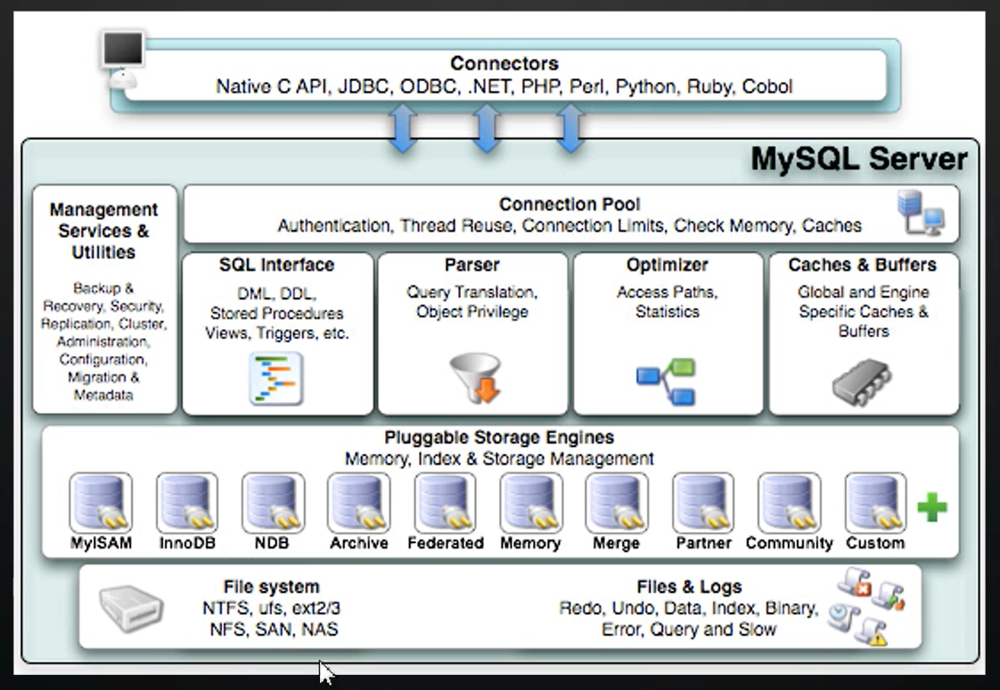

## MySQL执行流程图

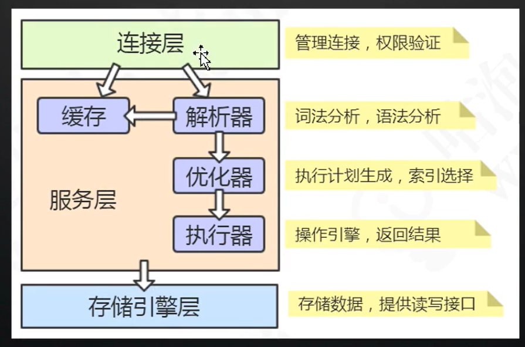

#### MySQL一条SELECT语句的执行流程图


#### MySQL一条Update语句的执行流程图

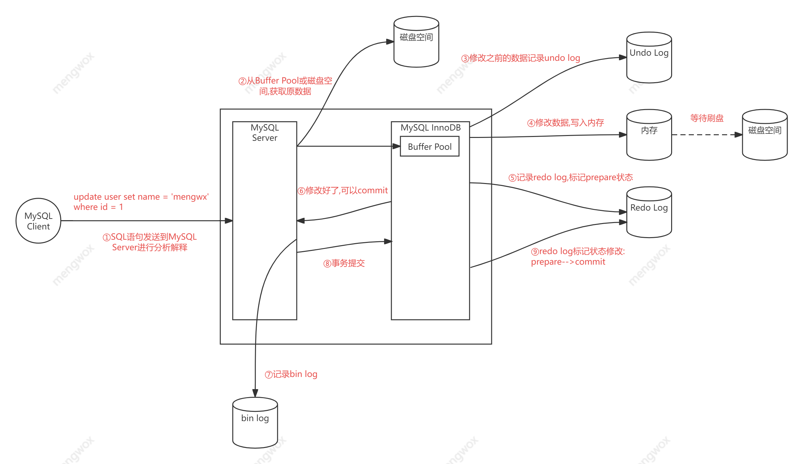

## MySQL InnoDB存储引擎架构
### InnoDB架构图

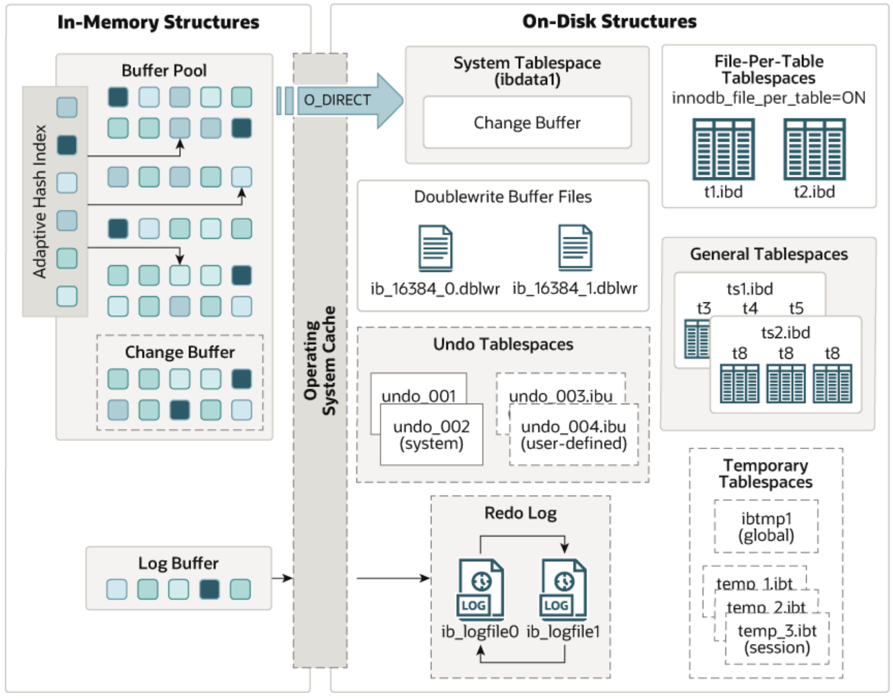

### Buffer Pool 缓冲池

Buffer Pool,是InnoDB用来缓存磁盘I/O查询出来的数据库数据存放的地方.通过对经常查询的数据进行缓存,大大提高请求响应速度.

```markdown
-- 查看系统变量:
show variables like '%innodb_buffer_pool%';
-- 查看服务器状态:
show status like '%innodb_buffer_pool%';
```

InnoDB使用LRU算法来管理缓冲池Buffer Pool.(链表实现,不是传统的LRU,分成了young和old,完成冷热数据替换)

### MySQL  InnoDB 页

InnoDB设定了一个存储引擎从磁盘读取数据到内存的最小的单位,这个就叫做`页`.

操作系统内,也有页的概念.一般默认是4KB; 而InnoDB 页 的默认值为16KB.如果要修改这个值的大小, 需要清空数据库所有数据并重新初始化MySQL服务.

- 修改数据的时候, 是先将修改后的数据写入到Buffer Pool,而不是直接写到磁盘.当内存的数据页与磁盘数据不一致的时候, 我们把它叫做`脏页`. 而InnoDB后台有专门的线程,每隔一段时间,就会把Buffer Pool的数据写入到磁盘. 这样的一个操作,我们称之为:`刷脏`.

Buffer Pool就是用来在内存中,缓存页的数据的缓存区,这样设计的作用,就是为了提高读写效率,减少磁盘I/O次数.

```mysql
show variables like 'innodb_page_size';-- 查看page大小命令
```

### log buffer刷盘时机

```mysql
show variables like 'innodb_flush_log_at_trx_commit';-- 默认1
```


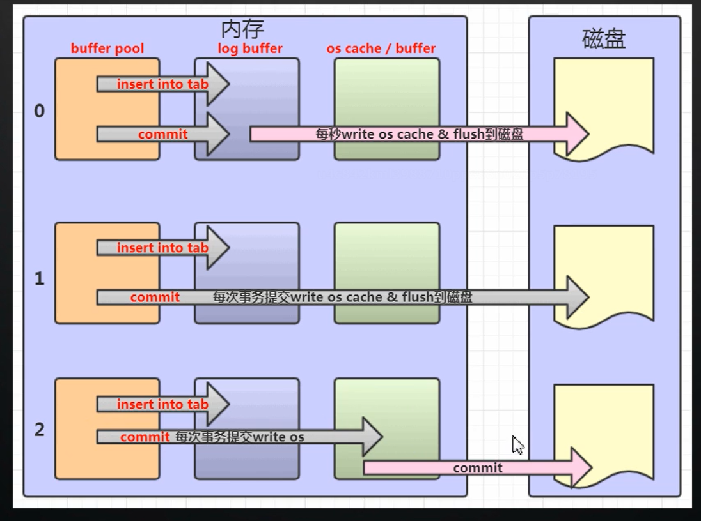

### Redo Log

是InnoDB存储引擎特有的日志类型，主要用于保证事务的持久性。当InnoDB执行事务时，如果数据被修改，修改不会立即写入磁盘上的数据文件，而是先记录到重做日志中，当系统崩溃时，可以通过重做日志来恢复数据到崩溃前的状态。此外，重做日志是循环写入的，空间固定不会无限增大。


问: 因为刷脏不是实时的,如果在InnoDB刷脏的动作之前,数据库崩溃了或者重启了,那么Buffer Pool的数据由于是存在内存中的,数据就丢失了,那么InnoDB是怎么解决这样的问题呢?

```markdown
- 内存的数据必须要有个持久化的补救措施.MySQL InnoDB就是通过Redo Log来实现的.
InnoDB会将所有对页的数据的修改操作,专门写入到Redo Log的日志文件.
如果数据库崩溃或重启了,在下一次数据库启动成功后,将会从Redo Log日志文件中,进行数据恢复操作(实现crash-safe,也叫崩溃恢复).
事务ACID的D(持久性),就是用Redo Log来实现的.
Redo Log,不是记录数据页更新之后的状态,而是记录的是"在哪个数据页上做了哪些修改".属于物理日志
```

问:同样是进行磁盘I/O写数据到文件中,为什么InnoDB要写入日志文件,而不是直接写入到DB File中呢?

- 涉及到磁盘寻址操作. 数据的存储是**随机**I/O, 而写入日志文件则是**顺序**I/O.  **顺序IO**效率更高.
  所以,在确保内存数据的持久化安全的情况下,使用顺序I/O,可以延迟刷盘时机,进而提高系统的吞吐量.
  	- show variables like 'innodb_log%';即可查看innodb的日志文件相关参数

redo log存储目录,见[MySQL 8.0官方文档](https://dev.mysql.com/doc/refman/8.0/en/innodb-redo-log.html)

### Undo Log

也是InnoDB存储引擎特有的日志类型，其主要作用是用于实现事务的原子性。当事务进行修改操作时，InnoDB会记录一份相反的操作到撤销日志中，如果事务执行失败或者调用了回滚操作，InnoDB可以利用撤销日志来将数据恢复到事务执行之前的状态。撤销日志还可以用于实现多版本并发控制（MVCC），使得在读取数据时可以获得事务开始前的数据快照。

undo log和redo log都是和数据修改有关的日志,两者结合起来,就保证了事务的原子性和持久性,所以两者统称为:事务日志

```markdown
undo log(撤销日志,或回滚日志), 记录了事务发生之前的数据状态, 分为:
	- insert undo log
	- update undo log
如果修改数据时,出现了异常,需要进行事务的回滚,就可以通过undo log来实现回滚操作(保证原子性)
undo log,记录的是反向的操作.比如:
	- insert会记录delete.
	- update会记录update之前的值.
和redo log记录在哪个物理页做了什么操作不同,所以undo log属于逻辑日志
	- show variables like '%undo%';
```

### Binlog

是MySQL Server层的日志，不特定于存储引擎。它记录了所有修改数据库数据的语句（DDL和DML），但不包括SELECT和SHOW这类的操作。它的主要作用有两个：一是用于复制，确保主从数据库之间的数据一致性；二是用于数据恢复，当数据丢失时，可以通过回放二进制日志来恢复数据。二进制日志采用追加写入的方式，当文件达到一定大小后，会创建一个新的binlog文件继续记录。

### Change Buffer 写缓冲

Change Buffer,是Buffer Pool的一部分.

Change Buffer,需要进行update/insert/delete操作的数据,先行缓存存放的地方,最后通过刷盘操作,将缓存的数据写入实际存储数据的磁盘中.

### Redo Log Buffer

将需要记录redo log和undo log的日志数据也缓存起来,减少磁盘I/O的次数.

Log Buffer写入日志文件的时机, 由一个参数控制,默认是1.

​	- show variables like 'innodb_flush_log_at_trx_commit';

### Adaptive Hash Index

相关参数: 开启`innodb_adaptive_hash_index` 关闭`--skip-innodb-adaptive-hash-index`

自适应哈希索引使InnoDB在具有适当的工作负载组合和足够的缓冲池内存的系统上执行更像内存数据库，而不会牺牲事务特性或可靠性

### 总结

Buffer Pool和Change Buffer的设计,都是为了尽可能减少磁盘I/O的次数,如果没有缓存,每次CRUD都要将数据通过磁盘I/O交互,而磁盘I/O的速度远远不如内存I/O.

Log:

- Redo log: 保障事务的持久性, 保障MySQL Crash-safe

- Undo log: 保障事务的原子性, 保障事务失败时的回滚操作, 用于实现MVCC, 获取事务开始前的数据快照Snapshot
- bin log: 用于数据恢复, 数据备份, 分布式场景的数据一致性保障

## InnoDB索引

有3种类型的索引, 分别是:

- Normal 普通索引
- Unique 唯一索引(主键索引是一种特殊的唯一索引)
- Full Text 全文本索引

### InnoDB索引的存储模型演变

二叉查找树 --> 二叉平衡查找树(AVL树) --> 多路平衡查找树(B Tree)

#### 二叉查找树 Binary Search Trees

规则: 

- 插入节点的值,比当前index节点小时, 向左移动
- 插入节点的值,比当前index节点大时, 向右移动

缺点: 树不平衡, 最坏的情况下, 树可能演变成了链表的结构

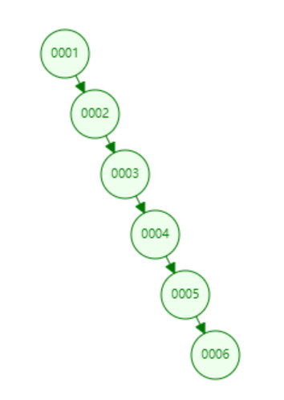

#### 二叉平衡查找树 AVL Trees (Balanced binary search trees)

通过`左旋`, `右旋`的操作, 达到AVL树相对比较平衡

规则: 任意叶子节点的深度之差不超过1

缺点: 分支只能有2个; 数据量越大, 树的深度就越大, 不适合作为数据库的存储模型, 会增加磁盘I/O的次数

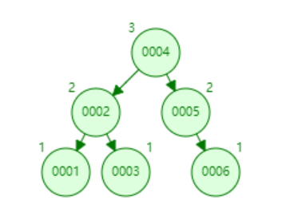

#### 多路平衡查找树 B Trees

概念:

- 度Degree: 分支所拥有的子树数量, N + 1
- 键值数: N

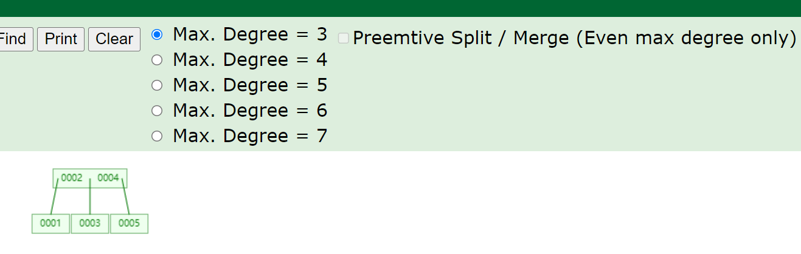

#### B+ Tree 加强版多路平衡查找树

概念, 同B Tree, 只是数量不同

- 度Degree: N
- 关键字数: N

特征:

- 只有叶子节点,才存储数据
- 叶子节点之间,组成了一个单向循环链表
- 检索规则为左闭右开, 即1<= key < 28

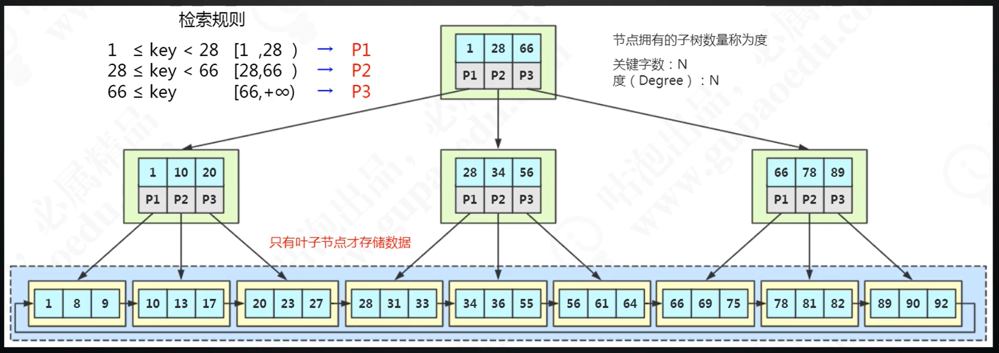

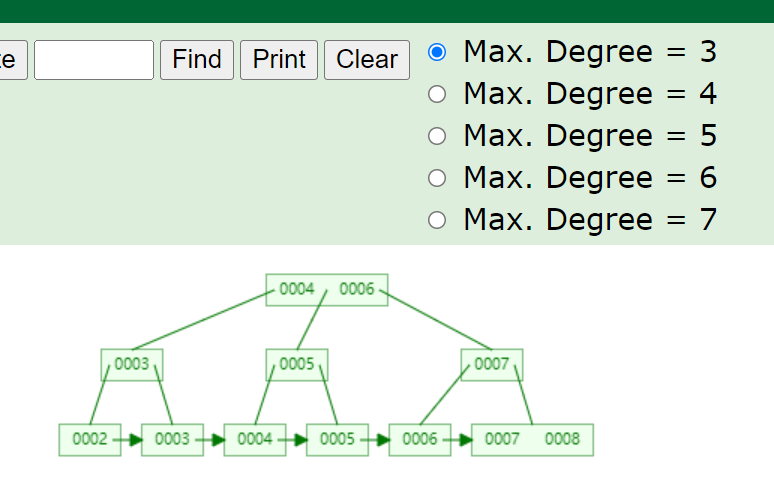

##### B+ Tree存储数据计算示例

如示例所示, 假设:

- 数据库的1条记录占用1KB
- 数据库使用默认16KB大小的Page
- 表所用的索引是bigint, 键值 + 指针 假设是14bit
- 那么一个非叶子节点(实际是一个Page, 16KB) 可以存放的索引数是16KB/14bit ≈ 1170
- 那么, MySQL对于该索引所用的B+ Tree将会是1170路平衡查找树-加强版
- 假如树的深度是2, 那么1170 * 1170 * 16 = 21,902,400; 也就是说数据库数据不超过2190万条时, 只需要3次IO
- 所以, MySQL使用B+ Tree来作为数据存储模型

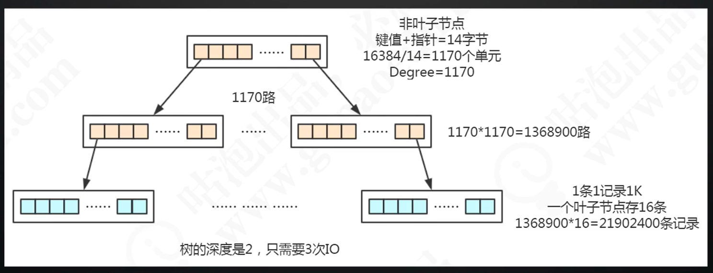

##### 为什么不用红黑树作为索引存储的数据模型?

虽然红黑树也是Binary Search Tree的一种, 但是红黑树主要是满足这样的一个约束:

- 从根节点到叶子节点的最长路径不大于最短路径的2倍

所以, 红黑树不适合作为MySQL索引存储的数据模型的原因有:

- 数据检索的效率不如B+ Tree稳定, 因为红黑树的路径时长时短, 而B+ Tree的路径是固定的

### InnoDB索引使用原则

#### 聚集索引/聚簇索引:

- 当表有主键Primary Key时,InnoDB就会选用该主键作为聚集索引,生成B+Tree
- 当表没有PK,但是有Unique Key时,且Unique Key这列的数据没有null数据,InnoDB将会选择这个Unique Key作为聚集索引
- 当表既没有PK,也没有Unique Key时,InnoDB将会给这个表加一个名为`_rowid`隐藏的列,然后将该列作为聚集索引
- 除了主键索引外, 其他的索引都是辅助索引

#### 离散度

离散度, 意味着一个字段的所有数据是否存在重复.

- 离散度计算公式: count(distinct (column_name) ) / count(column_name)

- 离散度高, 意味着重复的数据很少

- 离散度低, 意味着重复的数据很多

通过`show indexes from table_name;`来查看一个表的索引信息.

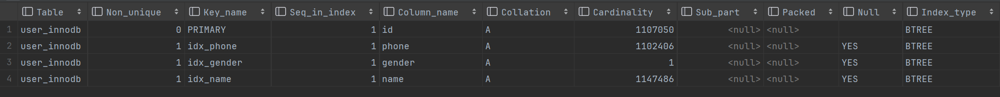

如上图所示, Cardinality列表示了存在了多少不重复的数据, Cardinality值越大, 说明该索引的离散度越高.

而, 像`gender性别`这样的字段,就没有必要建索引.因为性别要么是男,要么是女; 离散度太低.

#### 误区

1. 在所有的字段上都创建索引
2. 在离散度低的字段上创建索引

#### 联合索引的最左匹配原则:

想要复合索引生效,那么就不能跳字段使用

当有一个复合索引,例如:a, b, c 构建了一个复合索引.

```markdown
select * from table where a = '1' and c = '1';//使用到了复合索引,但是索引只生效到a='1'
select * from table where a = '1' and b = '1' and c = '1';//完美使用到了复合索引.where后面的条件,索引都生效
select * from table where c = '1' and a = '1';//该条和第一条实际上是一样的,因为优化器会对SQL进行优化,索引生效到a=1
select * from table where b = '1' and c = '1';//该条没法用到索引,因为索引的最左匹配原则,必须从第一个a开始
```

#### 回表, 覆盖索引, 索引条件下推

***回表***

1. 使用了辅助索引进行查询, 且查询列有除了辅助索引和主键索引之外的字段
2. 那么这个时候, MySQL会先去辅助索引的B+树找到***辅助索引和主键***
3. 然后, 根据***主键的值***, 回到主键索引的B+树上
4. 最后, 在主键索引B+树的叶子节点找到满足条件的完整行数据的物理存储地址

那么, 回到主键索引B+树继续查找的这个操作, 就被叫做***回表***


***覆盖索引***

依据上面***回表***的概念, 覆盖索引的含义是:

- 不需要回表的操作
- 使用辅助索引进行查询时, 需要的查询列已经在辅助索引的B+树的节点上可以找到
- 这时, MySQL将不会触发回表操作.
- 当用explain sql语句时, 将能够在***Extra***列看到内容:`Using index`

***索引条件下推***

索引条件下推, ICP(Index Condition Pushdown)

属性设置, 默认是开启的

```mysql
set optimizer_switch = 'index_condition_pushdown=off'; -- 关闭索引下推
set optimizer_switch = 'index_condition_pushdown=on';  -- 开启索引下推

-- employees表DDL
create table employees
(
    emp_no     int             not null
        primary key,
    birth_date date            null,
    first_name varchar(14)     not null,
    last_name  varchar(16)     not null	,
    gender     enum ('M', 'F') not null,
    hire_date  date            null
)
    charset = latin1;

create index idx_lastname_firstname
    on employees (last_name, first_name);

-- 查询语句
select * from employees where last_name ='wang' and first_name like '%zi';
```

1. 当查询语句用到了2个条件, last_name和first_name
2. `employees`表有1个联合索引: `last_name, first_name`
3. 那么last_name命中联合索引, 但是first_name是右模糊匹配, 将不会命中索引
4. 这时first_name, 其实是在last_name命中联合索引后的数据集中, 做筛选操作
5. 当索引条件下推***关闭***时, explain查询语句将会看到, Extra中显示***`Using Where`***. 这时,是MySQL存储引擎将满足last_name的数据集全部返回给Server层; 再由, Server层对所有的数据集做一个`where first_name like '%zi'`的筛选
6. 而, 当索引条件下推***开启***时, explain语句将会看到, Extra中显示***`Using Index Condition`***. 这时, 是MySQL存储引擎将满足last_name的数据集取出后, 再对数据集做一个`where first_name like '%zi'`的筛选; 之后, 存储引擎才会将筛选后的数据集返回给Server层

可以发现: 开启索引条件下推后, 存储引擎返回给Server层的数据集更小, 带宽更小, 效率更高; 这就是索引条件下推的作用.

通过将索引条件下推到存储引擎层, 来达到优化性能的目的.

#### 总结

***应该创建什么样的索引?***

1. 在用于where判断, order排序, join的on字段上创建
2. 索引的个数不应过多
3. 离散度低的字段, 例如:性别, 不应该建索引
4. 频繁更新的值, 不要作为主键或索引(会引起***页分裂***)
5. 联合索引, 尽量按离散度的高低,从左到右排序创建
6. 尽量创建联合索引, 而非单列索引

**Question1: 过长的字段, 怎么建立索引?**

**Question2: 为什么不建议用无序值(身份证, UUID)作为索引?**

***什么时候用不到索引?***

1. 索引列上使用函数(replace, substr, concat, sum, count, avg), 或表达式
2. 字符串没有加引号, 导致出现了隐式转换
3. like条件中前面带`%`
4. 负向查询会用到索引吗?
   1. 不一定会用不到索引, 也不一定会用到索引
   2. 因为MySQL的优化器, 是Cost Based Optimizer, 基于成本开销的优化器, 会选择开销成本最低的一种执行计划
   3. 而Oracle的优化器, 是Rule-Based Optimizer, 基于规则的优化器

### InnoDB数据存储结构图

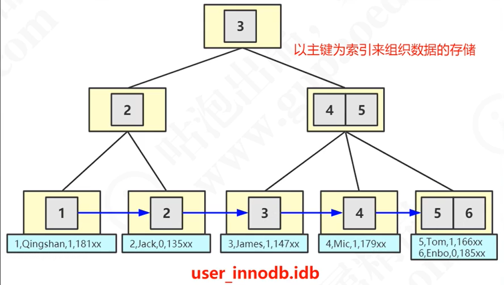


## MYISAM数据存储结构图

MYD文件, MYISAM Data

MYI文件, MYISAM Index

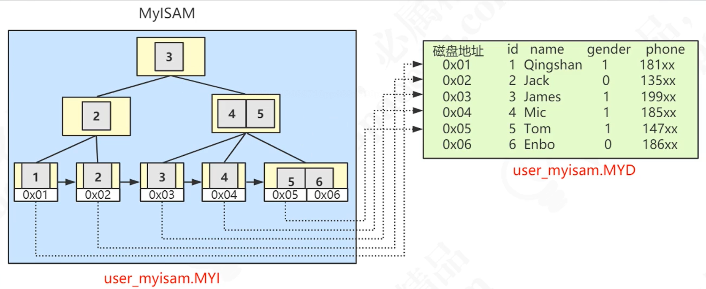

## MySQL 常用存储引擎对比

### Archive(2个文件)

```markdown
这些紧凑的未索引的表,用于存储和检索大量很少引用的历史, 存档或安全审计信息.
- 特点: 不支持索引, 不支持update/delete
```

### CSV(3个文件)

```markdown
- 在磁盘空间内,有3个文件,后缀名分别为frm,csv,csm
- 它,实际上是带有逗号分隔值的文本文件.CSV表允许以CSV格式导入或转储数据.
- 因为CSV表没有索引,所以通常在正常操作期间,将数据存储在InnoDB表中,并且只在导入或导出阶段使用CSV表
- 特点:不允许空行,不支持索引.格式通用,可以直接编辑,适合在不同数据库之间导入导出(也就是数据迁移)
```

### Memory(1个文件)

```markdown
- 在磁盘空间内,只有一个后缀名为frm的文件,该文件是用来记录表结构的
- 优点:将数据放在内存里面,读写的速度很快
- 缺点:但是如果数据库崩溃或者重启,内存上的数据会全部清空,只适合做为临时数据存储的一种方式
```

将所有的数据存储在RAM上,以便在需要快速查找非关键数据的环境中快速访问.

### MyISAM存储引擎(3个文件)

```markdown
- 一个MyISAM表,在磁盘空间有3个文件,MYI文件,MYD文件,以及用来存储表结构的FRM文件.
MYI文件,保存了索引和数据库数据的地址值(该地址值指向MYD文件的数据库数据)
MYD文件,保存了数据库数据

适合只读之类的数据存储,有较高的插入和查询速度,存储了表的行数(count速度会更快)
支持表锁,不支持事务
```

### InnoDB存储引擎(2个文件)

```markdown
- InnoDB表,在磁盘空间有2个文件,frm文件存储表结构,ibd文件存储实际的数据.
- 特点:
    支持事务,支持外键
    支持行锁,支持表锁
    支持读写并发,写不阻塞读(MVCC, Multi Version Concurrency Control)
    特殊的索引存放方式,可以减少I/O,提升查询效率
- 适合:经常更新的数据存储,且存在并发读写或有事务处理的数据
```

文件中,存放了索引及数据库数据.其中,必然有一个聚集索引(Cluster Index)的B+Tree,其叶子节点存放了一条数据的所有字段数据.

### MySQL体系结构总结:

按架构进行分层:

1. 连接层, 跟客户端对接
2. 服务层Server, 真正执行SQL语句操作
3. 存储引擎层, 与硬件(如:磁盘)存储的数据交互

## 事务

ACID

- Atomicity 原子性. 事务内的数据操作要么全部成功,要么全部失败.
- Consitent 一致性.  
- Isolation 隔离性. 不同事务之间数据隔离透明, 互不影响.
- Durable 持久性. 只要事务提交成功且Page页没有损坏, 数据就会存储在磁盘上, 不可能因为mysql crash丢失.

### 事务并发问题

事务并发三大问题:其实都是数据库读一致性问题导致,由数据库提供一定的事务隔离机制来解决

#### 脏读

一个事务读取到了其他事务未提交的数据,造成读不一致.

#### 不可重复读

一个事务读取到了其他事务已提交的数据,造成读不一致,针对update/delete

#### 幻读

一个事务读取到了其他事务插入的数据,造成读不一致.只针对Insert语句

#### 事务的4种事务隔离级别

1. Read Uncommited (RU 未提交读)

   ```markdown
   未解决任何并发问题
   事务未提交的数据对其他事务也是可见的,会出现脏读,不可重复读,幻读
   ```

2. Read Commited (RC 已提交读)

   ```markdown
   解决脏读问题
   一个事务开始之后,只能看到已提交的事务所做的修改,会出现不可重复读,幻读
   ```

3. Repeatable Read (RR 可重复读)

   ```markdown
   解决不可重复读问题
   在同一个事务中多次读取同样的数据结果是一样的,这种隔离级别会出现幻读的问题
   ```

4. Serializable(串行化)

   ```markdown
   最高的隔离级别,通过强制事务的串行执行,解决了所有的并发问题
   ```

### MySQL InnoDB是怎么做到RR级别却解决了幻读问题的?

有2种解决方案,可供选择:

1. 在读取数据前,对其加锁,阻塞其他事务对数据进行修改(LBCC, Lock Based Concurrency Control)
2. 生成一个数据请求时间点的一致性数据快照(Snapshot), 并用这个快照提供一定级别(语句级或事务级)的一致性读取(MVCC, Multi Version Concurrency Control)

#### MVCC

效果:建立了一个快照,同一个事务内,不管执行多少次查询,结果都是一样的

本质: 创建了两个隐藏列, DB_TRX_ID(创建版本), DB_ROLL_PTR(删除版本). 当前事务只能看到`小于等于创建版本, 大于等于删除版本的`数据

MVCC的规则:

1. 一个事务能够看到的数据版本
   1. 该事务第一次查询之前已提交的事务的修改
   2. 本次事务的修改
2. 一个事务不能够看到的数据版本
   1. 该事务第一次查询之后创建的事务(创建的事务ID比当前第一次查询的事务ID大)
   2. 该事务第一次查询之前活跃(未提交)的事务的修改

#### InnoDB是怎么设计的?

InnoDB为每行数据,都实现了3个隐藏字段

1. DB_ROW_ID, 6字节,行标识
2. DB_TRX_ID, 6字节,插入或更新行的最后一个事务的事务ID,自动递增(新增版本号)
3. DB_ROLL_PTR, 7字节, 回滚指针(删除版本号)

##### Read View(一致性视图) 存储内容

4个字段

1. m_ids{} ,列表,当前系统活跃的事务ID
2. min_trx_id ,m_ids列表的最小值事务ID
3. max_trx_id ,系统分配给下一个事务的ID
4. creator_trx_id , 生成readView事务的事务ID

##### Read View判断逻辑

0. 从数据的最早版本开始判断(undo log)
1. 数据版本trx_id = creator_trx_id, 那么本事务可以修改,可以访问
2. 数据版本trx_id < min_trx_id, 说明本事务在生成Read View已经提交, 可以访问
3. 数据版本trx_id > max_trx_id, 说明本事务在Read View生成之后才创建的, 不能访问
4. 数据版本trx_id 在[min_trx_id, max_trx_id]之间, 看看能否在m_ids{}列表中找到;如果可以找到,则不可以;反之,则可以.
5. 如果当前版本不可见, 就找undo log链中的下一个版本,重复0-4,反复循环.

#### RR与RC的MVCC的区别

Repeatable Read(RR)和Read Commited(RC)都有设计MVCC,但是:

1. RR的Read View创建时机,只在事务的第一次查询
2. RC的Read View创建时机,却在事务的每一次查询

所以,RC存在着不可重复读和幻读的问题

#### MySQL 锁的基本类型

InnoDB支持行锁,表锁; MyISAM只支持表锁,具体内容可参考官网

1. 共享锁-行锁, Shared Locks, 简称S锁
2. 排他锁-行锁, Exclusive Locks, 简称X锁
3. 意向共享锁-表锁, Intention Shared Locks
4. 意向排他锁-表锁, Intention Exclusive Locksr

锁,实际上是锁聚集索引

#### 锁的算法

- Record Lock, 记录锁
- Gap Lock, 间隙锁
- Next-Key Lock,临键锁

临键锁,就是InnoDB使用RR级别的事务隔离能够做到解决幻读的关键

##### 死锁的3个条件

1. 互斥
2. 不可被剥夺
3. 形成等待环路

##### 如何查看锁信息(日志)

步骤:

1. show status like 'innodb_row_lock_%';

##### 死锁的避免

1. 操作多张表时,尽量以相同的顺序来访问(避免形成等待环路)
2. 批量操作单张表数据的时候,先对数据进行排序(避免形成等待环路)
3. 申请足够级别的锁,如果要操作数据,就申请排他锁Exclusive Locks(X锁)
4. 尽量使用索引访问数据, 避免没有where条件的操作, 避免锁表
5. 如果可以,将大的事务分解为一个个的小事务
6. 使用等值查询而不是范围查询来查询数据,命中记录Record, 避免间隙锁对并发的影响


## MySQL性能优化总结
### MySQL集群

#### 读写分离

#### 主从复制

由slave从节点,启用后台线程,去访问master主节点的binlog日志,通过binlog日志实现主从复制功能.

因此,数据在主节点,从节点上存在数据一致性问题(因为,从节点复制存在延迟)

而MySQL主从复制, 默认是**异步复制**

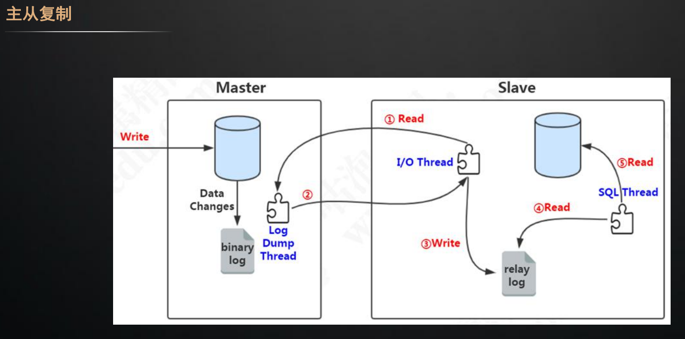

##### 主从复制的数据一致性问题(主从延迟)解决方案

1. 全同步复制

   - 数据在master写入后, 需等待该数据在其所有的slave同步完成后,再返回.

   - 缺点: 需等待所有slave同步完毕, 因此, 效率低, 耗时长.

2. 半同步复制

   - 数据在master写入后, 只需等待该数据在任意一个slave同步完成后即可返回.
   - 相比较与全同步复制, 效率高些, 耗时可以接受. 因此**推荐该方案**
   - 使用方式: 通过额外的插件提供`半同步复制`功能, 因此需手动下载该plugin

###### 半同步复制插件安装

```mysql
-- 在主节点上, 下载并安装半同步复制主节点插件, 并命名为: semi_sync_master.so
install plugin rpl_semi_sync_master soname 'semi_sync_master.so';

-- 在从节点上, 下载并安装半同步复制从节点插件, 并命名为: semi_sync_slave.so
install plugin rpl_semi_sync_slave soname 'semisync_slave.so';
```

下载安装之后, 半同步复制功能默认是关闭的,需手动开启或在my.conf配置开启

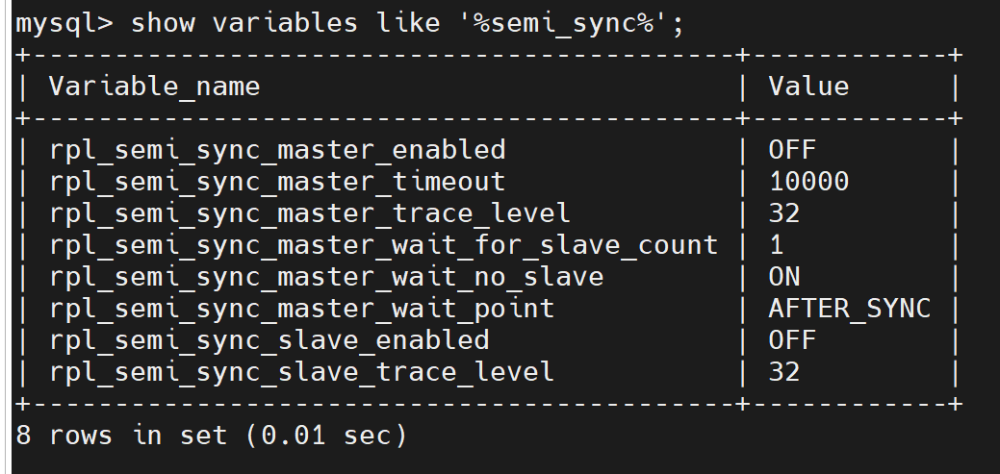

- 水平分库分表
- 垂直分库

#### 常见的MySQL高可用方案

1. 主从HAProxy + keepalived
2. NDB Cluster
3. Galera Cluster For MySQL
4. MMM(MySQL Master High Available)
5. MMA, Master-Master replication manager For MySQL
6. MGR, MySQL Group Replication, 即MySQL Cluster

#### 优化器层面

##### 慢SQL优化

哪些SQL语句慢? 开启MySQL慢日志记录配置

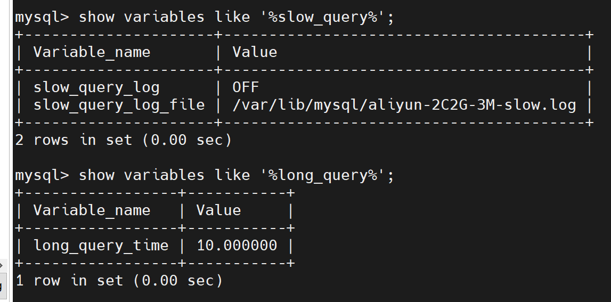

- `slow_query_log`表示慢查询日志是否开启; ON开启, OFF关闭
- `slow_query_log_file`显示慢查询日志的具体存放位置
- `long_query_time`表示具体多少秒被认作为慢查询, 默认是10秒

如何分析MySQL生成的慢日志? 比如: 如何统计慢日志中, 出现最频繁的10条SQL语句

- 使用mysql附带的工具: `mysqldumpslow`

`show profiles`工具, 查看mysql各功能情况

##### 根据执行计划进行优化

explain sql语句,结果列的含义, 见[MySQL官网](https://dev.mysql.com/doc/refman/8.0/en/explain-output.html)

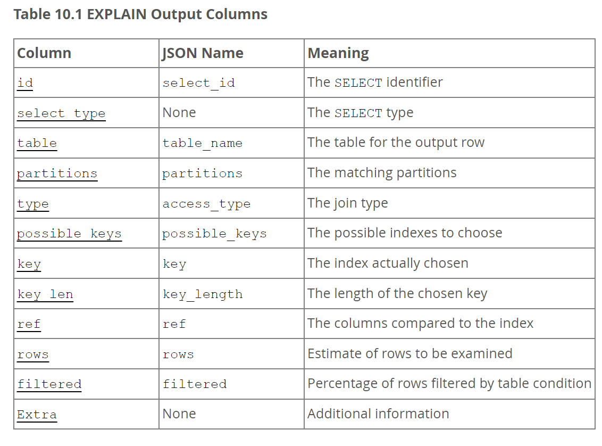

MySQL优化:

表的存储

1. SQL与索引

2. 存储引擎与表结构

3. 数据库架构(主从,集群,高可用架构等等)

4. MySQL配置调优

5. 硬件与操作系统
