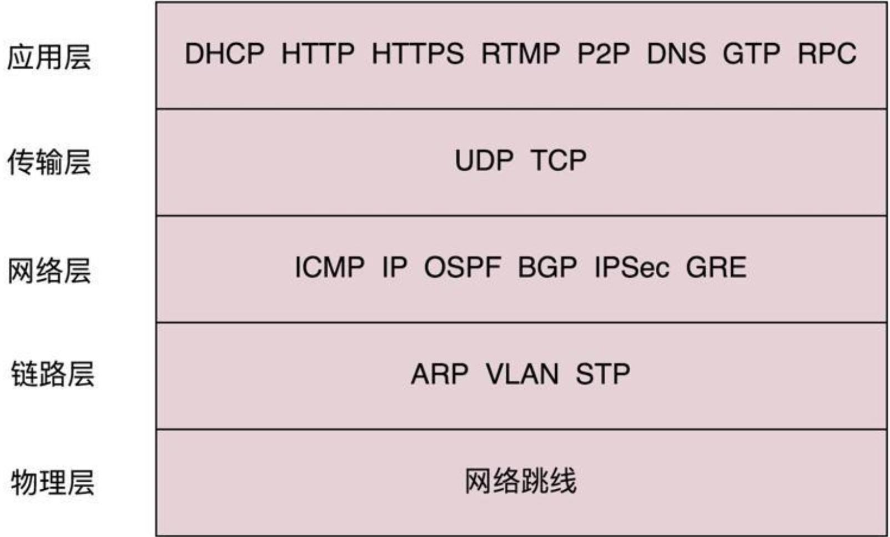
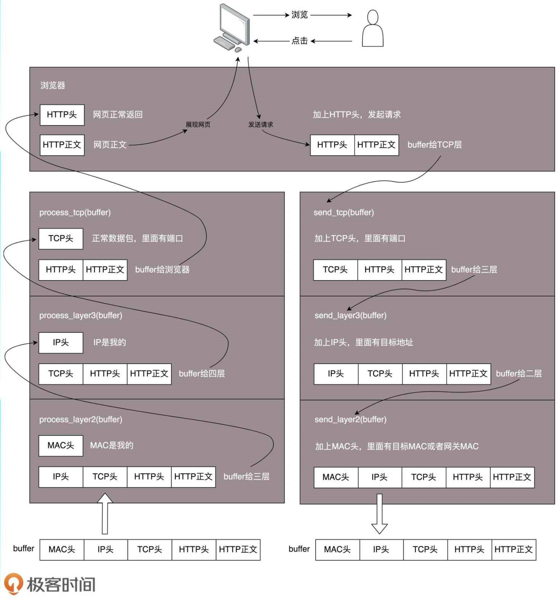
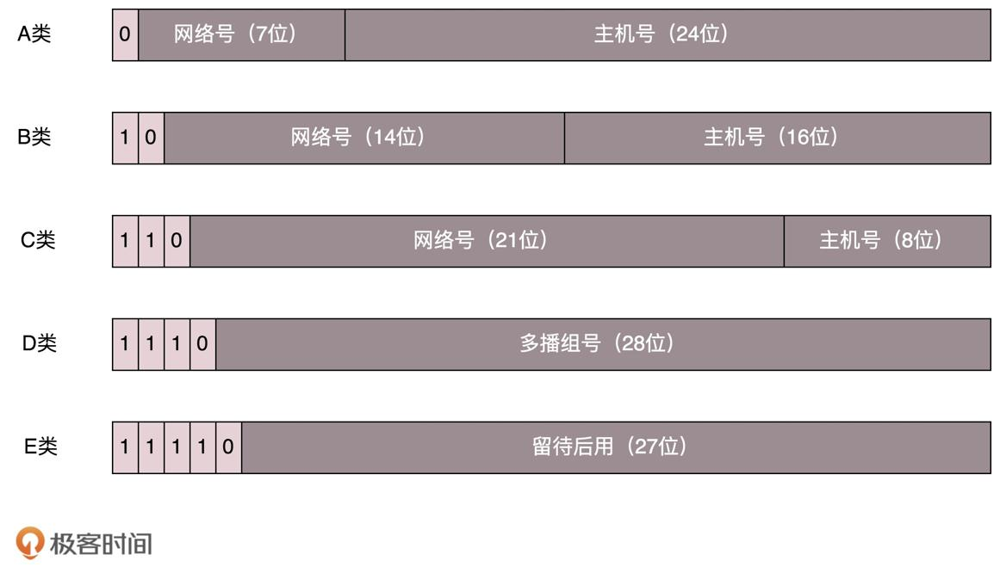
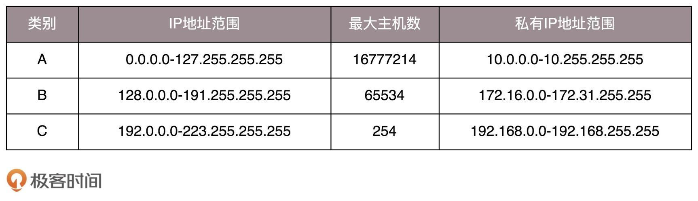
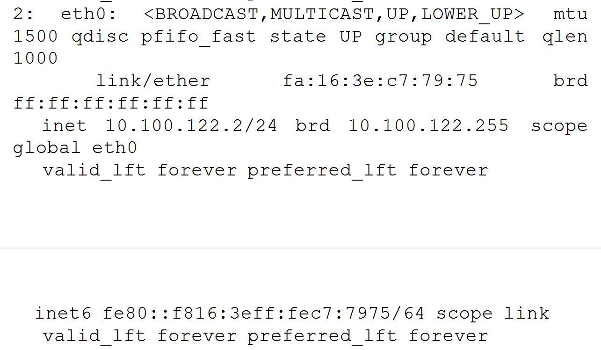
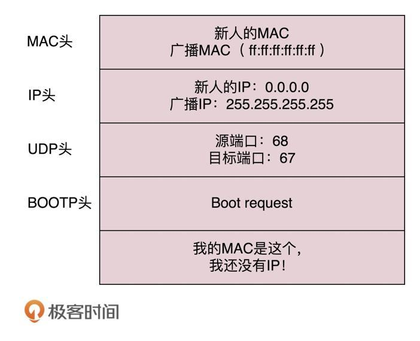
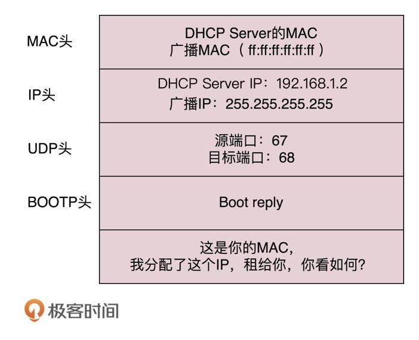

# 趣谈网络协议

## 第1讲-为什么要学习网络协议？

协议三要素：

- 语法：内容要符合一定的规则和格式
- 语义：内容要代表某种意义
- 顺序：先做什么，后做什么

常见的网络协议：

- 应用层

  - 地址簿协议
    - 一般DNS
    - 更加精准HTTPDNS

  - 浏览请求
    - 普通HTTP
    - 加密传输HTTPS

- 传输层

  - 无连接UDP
  - 面向连接TCP
    - 面向连接，TCP会保证这个包能够到达目的地。如果不能到达，就会重新发送，直至到达为止。
    - 内容里，会包含2个端口，分别是：浏览器监听的端口，目的地服务器监听的端口。

- 网络层

  - IP层
    - 内容里，会包含2个IP地址，分别是：源IP（我从哪里来），目的地IP（我要去哪里）
    - 如何去目的地IP？
      - 如果是外地人
        - 步骤：
          - IP地址发给网关Gateway，吼一声（ARP协议：Who has？），网关返回目的地的本地地址（MAC地址）
          - 包到达网关Gateway。
          - Gateway将包发送，经过一个个网关，最终到达最后一个网关
          - 最后一个网关，吼一声（Who has 目的地IP？），目的地服务器回复MAC地址
          - 最后一个网关，根据目的地服务器MAC地址，将包发送到目的地服务器
        - 网关Gateway
          - 操作系统启动时，DHCP协议会配置IP地址，及网关的默认IP地址`192.168.1.1`
          - 网关往往是个路由器，到某个IP地址怎么走（这个叫路由表）
          - 常用的路由协议
            - OSPF
            - BGP
  - MAC层

## 第2讲-网络分层的真实含义是什么？

什么是二层设备？

就是将网络包的MAC头取下来，然后决策这个网络包应该丢弃、转发，还是自行处理。

什么是三层设备？

就是将网络包的MAC头取下来，然后将IP头也取下来，然后决策这个网络包应该丢弃、转发，还是自行处理。

完整的网络包，可以有下层没上层，但是绝对不可能有上层没下层。

## 第3讲-ifconfig：最熟悉又陌生的命令行

### IPv6

128位

### IPv4

32位，被分为以下5类：

A，B，C类均是由**网络号**+**主机号**组成，它们的范围如下：

C类的最大主机数太少，而B类的最大主机数又太多。

于是，有了一个折中的方式，那就是：CIDR，无类型域间选路。

#### CIDR（无类型域间选路）

CIDR，Classless Inter-Domain Routing。

无类别域间路由 (CIDR) 是一种 IP 地址分配方法，可提高互联网上的数据路由效率。每台连接到互联网的计算机、服务器和最终用户设备都有一个与之关联的唯一编号，称为 IP 地址。设备通过使用这些 IP 地址相互查找和通信。组织使用 CIDR 在其网络中灵活高效地分配 IP 地址。

格式如：`10.100.122.2/24`

其中：

- /24，表示32位中前24位是网络号，后8位是主机号；即10.100.122这段是固定的。
- 也就是说IP地址范围为：10.100.122.0 ~ 10.100.122.255

伴随着CIDR存在的：

- 一个是广播地址brd（10.100.122.255），如果网络包发送到这个地址，那么所有10.100.122网络里面的机器都能够收到网络包。
- 另一个是子网掩码（subnet mask）255.255.255.0，IP地址与子网掩码进行按位AND计算后，255代表二进制的`1111 1111`，而1与任何数AND，结果还是1。0代表二进制的`0000 0000`，而0与任何数AND，结果还是0。
- 因此，IP地址`10.100.122.x` 与 子网掩码`255.255.255.0` AND计算后的结果永远都是`10.100.122.0`
- `10.100.122.0`即为网络号。

#### lo网卡

lo，全称loopback，又称环回接口，往往分配到127.0.0.1这个地址，这个网卡只用与本机通信。

#### MAC地址

十六进制，6个byte表示；就像是身份证，是唯一标识。

唯一性设计，是为了组网的时候，不同的网卡在同一个网络里的时候，可以不用担心冲突。

从硬件角度，来保证MAC地址的唯一性。

MAC地址的通信范围很小，局限在一个子网里。例如：

- 10.100.122.1访问10.100.122.244，可以用MAC地址直接通信。
- 10.100.122.1访问10.100.121.1，则无法使用MAC地址直接通信。

#### 网络设备的状态标识

net_device_flags，网络设备的状态标识，格式如：`<BROADCAST,MULTICAST,UP,LOWER_UP>`

- UP，标识网卡处于启动状态
- BROADCAST，标识网卡有广播地址，可以发送广播包
- MULTICAST，标识网卡可以发送多播包
- LOWER_UP，标识L1是启动的，即网线连接

MTU 1500解释说明：

最大传输单元，MTU（Maximum Transmission Unit），指的是网络能够传输的最大数据的网络包的大小，默认值是1500字节。

### 小结

1. IP是地址，具有定位功能，而MAC是身份证，不具备定位功能，但是有唯一性。
2. CIDR，可用来判断是否是本地人。
3. IP分为：公有IP，私有IP

### 课后思考题

1. 你知道 net-tools 和 iproute2 的“ 历史” 故事吗？
2. 这一节讲的是如何查看 IP 地址， 那你知道 IP 地址是怎么来的吗？

## 第4讲-DHCP 与 PXE：IP 是怎么来的， 又是怎么没的？

DHCP，Dynamic Host Configuration Protocol，动态主机配置协议。

DHCP工作方式，以一台机器新加入一个网络为例：

1. 新机器，吼一声，称之为DHCP Discover

2. 新机器，发送一个广播包，包封装了UDP，UDP封装了BOOTP（DHCP是BOOTP的增强版）

3. 这个广播包的内容是：我是新来的，我的MAC地址是XXX，我还没有IP，谁能给我分配一个IP？

4. DHCP Discover格式如：

   

5. 如果网络中配置了DHCP Server的话，DHCP Server就是这些IP的管理员。这时它就知道来了一个新成员，因为这个MAC地址从来没有见过。

6. DHCP Server这时，会将一个IP租给新成员，这个动作叫做DHCP Offer。同时，DHCP Server将会记住分配给新成员的IP地址，不会再将这个IP租给后续新的成员。

7. DHCP Offer格式如：

   

8. DHCP Server将Offer信息、子网掩码、网关以及IP地址租用期等信息，发送到广播地址。

9. 新成员，收到了广播地址发来的广播包，知道了Server提供了一个IP租给它。

10. 如果存在多个DHCP Server，新成员将会收到多个广播包，会有多个IP地址可以租给它。

11. 一般而言，新成员将会使用最先回复的广播包提供的IP地址。

12. 然后，新成员，发送一个DHCP Request广播数据包，
